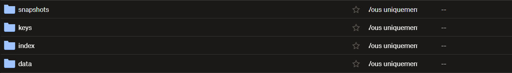
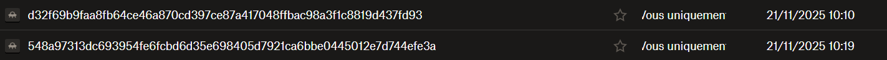

# Projet Linux Self Host

Ce projet visait à self hoster un service sur une machine linux sous Debian 13 (Trixie).
Nous avons fait le choix de séléctionner nous-même le projet que nous allions self hoster.
Nous avons choisi dans un premier temps [Netdata](https://github.com/netdata/netdata).
Puis nous avons basculé sur [Uptime Kuma](https://github.com/louislam/uptime-kuma).

## Netdata

Netdata possède une codebase en C, ce qui permet de le build avec CMake. Nous avons donc suivi le tutoriel de Netdata pour déployer et build le Netdata Agent.
Le Netdata Agent est un serveur web qui expose directement le service de metrics et de dashboard.

Malheuresement, une fois le projet build avec tous les prérequis, lors de la visite de la page principale du dashboard, le programme s'éteint en nous laissant un beau message `Segmentation Fault`. Nous ne pouvons malheuresement donc pas débugger cette erreur d'autant plus qu'elle n'est pas connue et les seules GitHub Issues laissées sur le repo parlent d'un problème de fréquence CPU sur les processeurs AMD, toutefois nous avons un processeur Intel.

## Uptime Kuma

Nous avons donc basculé sur Uptime Kuma qui lui possède une codebase en JavaScript avec NodeJS. Ceci nous permet de le build très facilement avec une simple `npm run setup`.
Ce projet est une interface de status page semblable à celle de Atlassian.

Ce projet utilise une base de données en SQLite ou MariaDB. Nous avons fait le choix d'utiliser MariaDB pour faciliter la performance et la compatibilité avec les services.

## Installation

Pour procéder à l'installation et le déploiement automatique du projet, nous avons créé le script [install.sh](install.sh). 
Ce script fait :

- L'installation des paquets nécessaires
- La création d'un utilisateur spécial pour le service (`kuma`)
- Le build du projet
- L'installation de la base de données et la sécurisation de celle-ci
- La création de la base de donnée pour le service
- La création du service

## Backup

Nous avons utilisé [restic](https://github.com/restic/restic) pour les backup, et Dropbox pour les stocker dans le cloud. Nous avons d'abord utilisé Google Drive mais Google demandait une confirmation pour poster une application et pouvoir l'utiliser avec leur API ce qui nous a fait tourner vers Dropbox.

Pour créer l'API dropbox, nous avons suivi cette [documentation](https://rclone.org/dropbox/)

Tout ce processus est mis dans un script [backup.sh](backup.sh). Ce script est éxécuté tous les 1h grâce à un job [cron](crontab) 
puis cette backup est envoyé sur notre remote dropbox grâce à rclone.

Voila les fichiers qui ont été bien ajoutés au dropbox

## Sécurité

Pour la sécurité nous avons utilisé [fail2ban](https://github.com/fail2ban/fail2ban) qui permet de bloquer les attaques brutforce sur le port 22.
Nous utilisons aussi [ufw](https://fr.wikipedia.org/wiki/Uncomplicated_Firewall) pour n'autoriser que le trafic sur le port `3001` en TCP qui est le port HTTP exposé par le service Uptime Kuma.

> Tout ceci est référencé dans le fichier [security.sh](security.sh)

Nous avons fait une config fail2ban pour customiser le ban sur le bruteforce ssh. Cette config se trouve dans le fichier [jail.conf](jail.conf)

## Monitoring

Étant donné que nous avons self hosté un service de monitoring, cela parait un peu bizarre de monitorer un service de monitoring.
Nous avons donc créé un petit [nginx](https://github.com/nginx/nginx) qui tourne en fond pour pouvoir ajouter une target sur uptime kuma et monitorer le serveur nginx.

Sur ce nginx nous avons setup un [jeu de 2048](https://github.com/kubowania/2048) en vanilla html/css/js pour tester :

Sur Uptime Kuma nous avons créé le monitor et une page de status qui ressemble à ça :

> L'installation s'effectue via le script [monitoring.sh](monitoring.sh)
